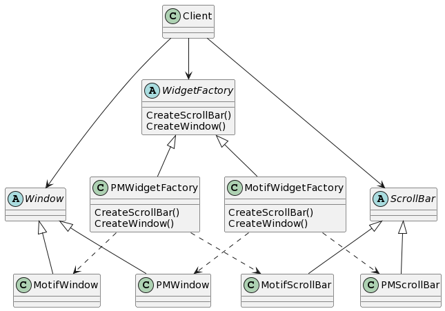
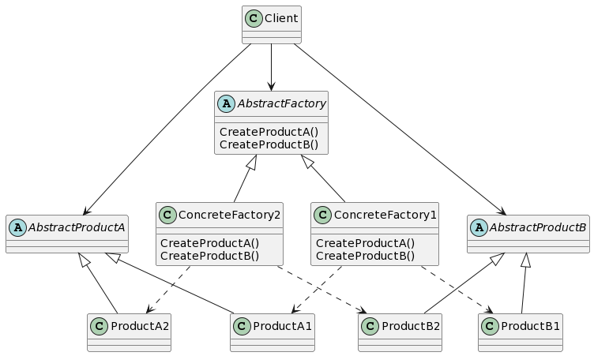
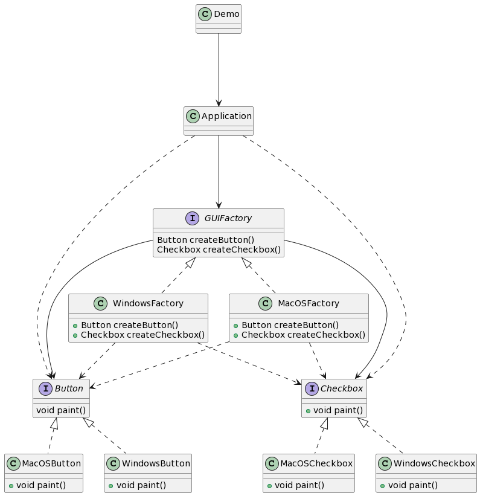
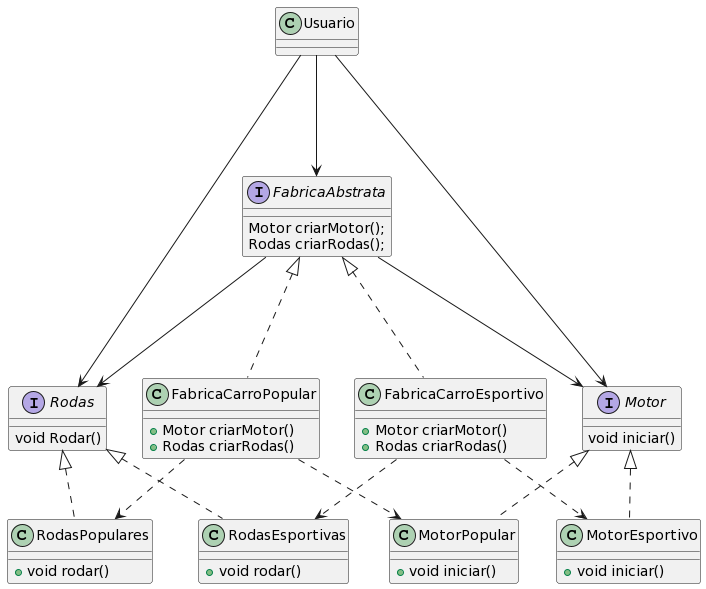

# Abstract Factory (GOF)


## Intenção
Fornecer uma interface para criação de famílias de objetos relacionados ou dependentes sem especificar suas classes concretas.


## Motivação
Considere um toolkit para construção de interfaces de usuários que suporte múltiplos estilos de interação (look-and-feel) tais como o Motif e o Presentation Manager.
Diferentes estilos de interação definem diferentes apresentações e comportamento para os widgets de uma interface de usuário, tais como barras de rolamento, janelas e botões. 

Para ser portátil entre vários estilos de aparência, uma aplicação não deve codificar rigidamente seus widgets para um determinado padrão. 
Instanciando classes específicas de estilo de interação para os widgets pela aplicação toda, torna difícil mudar o estilo no futuro.

Podemos resolver esse problema definindo uma classe abstrata WidgetFactory que declara uma interface para criação de cada tipo básico de widget. Existe também uma classe abstrata para cada tipo de widget, e subclasses concretas implementam os widgets para interação. 

A interface de WidgetFactory tem uma operação que retorna um novo objeto widget para cada classe abstrata de widget. Os clientes chamam estas operações para obter instâncias de widget, mas não têm conhecimento das classes concretas que estão usando. 
Desta forma, os clientes ficam independentes do padrão de interação usado no momento.





Existe uma subclasse concreta de WidgetFactory para cada estilo de interação.
Cada subclasse implementa as operações para criar o widget apropriado para aquele estilo de interação. 

Por exemplo, a operação CreateScrodarBar aplicada à MotifWidgetFactory instancia e retorna uma barra de rolamento de acordo com o Motif, enquanto que a correspondente operação aplicada à PMWidgetFactory retorna uma barra de rolamento para o Presentation Manager. 

Os clientes criam widgets exclusivamente através da interface de WidgetFactory e não tem conhecimento das classes que implementam os widgets para um padrão em particular. 
Em outras palavras, os clientes têm somente que se comprometer com uma interface definida por uma classe abstrata, não uma determinada classe concreta. 

UmaWidgetFactory também implementa e garante as dependências entre as classes concretas de widgets. 
Uma barra de rolamento Motif deveria ser usada com um botão Motif e um editor de textos Motif, e essa restrição é garantida automaticamente como conseqüência de usar uma MotifWidgetFactory.


## Aplicabilidade
Use o padrão Abstract Factory quando:
- um sistema deve ser independente de como seus produtos são criados,
compostos ou representados;
- um sistema deve ser configurado como um produto de uma família de
múltiplos produtos;
- uma família de objetos-produto for projetada para ser usada em conjunto,
e você necessita garantir esta restrição;
- você quer fornecer uma biblioteca de classes de produtos e quer revelar
somente suas interfaces, não suas implementações.


## Estrutura



## Participantes
- **AbstractFactory** (WidgetFactory)
    - declara uma interface para operações que criam objetos-produto abstratos.
- **Concrete Factory** (MotifWidgetFactory, PMWidgetFactory)
    - implementa as operações que criam objetos-produto concretos.
- **AbstractProduct** (Window, ScrodarBar)
    - declara uma interface para um tipo de objeto-produto
- **ConcreteProduct** (MotifWindow, MotifScrodarBar)
    - define um objeto-produto a ser criado pela correspondente fábrica concreta.
    - implementa a interface de Abstract Product.
- **Client**
    - usa somente interfaces declaradas pelas classes Abstract Factory e Abstract Product.


## Implementação
1. Mapeie uma matriz de tipos de produtos distintos versus as variantes desses produtos.

2. Declare interfaces de produto abstratas para todos os tipos de produto. Então, faça todas as classes concretas de produtos implementar essas interfaces.

3. Declare a interface da fábrica abstrata com um conjuntos de métodos de criação para todos os produtos abstratos.

4. Implemente um conjunto de classes fábricas concretas, uma para cada variante de produto.

5. Crie um código de inicialização da fábrica em algum lugar da aplicação. Ele deve instanciar uma das classes fábrica concretas, dependendo da configuração da aplicação ou do ambiente atual. Passe esse objeto fábrica para todas as classes que constroem produtos.

6. Escaneie o código e encontre todas as chamadas diretas para construtores de produtos. Substitua-as por chamadas para o método de criação apropriado no objeto fábrica.

### Exemplo Java
Neste exemplo, botões e caixas de seleção atuarão como produtos. Eles têm duas variantes: macOS e Windows.

O Abstract Factory define uma interface para criar botões e caixas de seleção. Existem duas fábricas concretas, que retornam ambos os produtos em uma única variante.

O código cliente trabalha com fábricas e produtos usando suas interfaces abstratas. Ele faz com que o mesmo código cliente funcione com muitas variantes de produtos, dependendo do tipo de objeto fábrica.

A Fábrica Abstrata pressupõe que você tenha várias famílias de produtos,
estruturadas em hierarquias de classes separadas (Botão/Checkbox). Todos os produtos da
mesma família têm a mesma interface comum.

Esta é a interface comum para a família de botões.

```java
public interface Button {
    void paint();
}
```

Todas as famílias de produtos têm as mesmas variedades (MacOS/Windows).

Esta é uma variante MacOS de um botão.

```java
public class MacOSButton implements Button {

    @Override
    public void paint() {
        System.out.println("You have created MacOSButton.");
    }
}
```

Esta é outra variante de um botão.

```java
public class WindowsButton implements Button {

    @Override
    public void paint() {
        System.out.println("You have created WindowsButton.");
    }
}
```
Caixas de seleção são a segunda família de produtos. Elas têm as mesmas variantes que os botões.

```java
public interface Checkbox {
    void paint();
}
```

Esta é uma variante de uma caixa de seleção.

```java
public class MacOSCheckbox implements Checkbox {

    @Override
    public void paint() {
        System.out.println("You have created MacOSCheckbox.");
    }
}
```

Esta é outra variante de uma caixa de seleção.

```java
public class WindowsCheckbox implements Checkbox {

    @Override
    public void paint() {
        System.out.println("You have created WindowsCheckbox.");
    }
}
```

A fábrica abstrata conhece todos os tipos de produtos (abstratos).

```java
public interface GUIFactory {
    Button createButton();
    Checkbox createCheckbox();
}
```

Cada fábrica concreta estende a fábrica básica e é responsável por criar
produtos de uma única variedade.

```java
public class MacOSFactory implements GUIFactory {

    @Override
    public Button createButton() {
        return new MacOSButton();
    }

    @Override
    public Checkbox createCheckbox() {
        return new MacOSCheckbox();
    }
}
```

Cada fábrica concreta estende a fábrica básica e é responsável por criar produtos de uma única variedade.

```java
public class WindowsFactory implements GUIFactory {

    @Override
    public Button createButton() {
        return new WindowsButton();
    }

    @Override
    public Checkbox createCheckbox() {
        return new WindowsCheckbox();
    }
}
```

Os usuários da fábrica não se importam com qual fábrica concreta estão usando, pois trabalham com fábricas e produtos por meio de interfaces abstratas.

```java
public class Application {
    private Button button;
    private Checkbox checkbox;

    public Application(GUIFactory factory) {
        button = factory.createButton();
        checkbox = factory.createCheckbox();
    }

    public void paint() {
        button.paint();
        checkbox.paint();
    }
}
```
Classe de demonstração. Tudo se reúne aqui.

A aplicação escolhe o tipo de fábrica e o cria em tempo de execução (geralmente na fase de inicialização), dependendo da configuração ou das variáveis de ambiente.

```java
public class Demo {
    private static Application configureApplication() {
        Application app;
        GUIFactory factory;
        String osName = System.getProperty("os.name").toLowerCase();
        if (osName.contains("mac")) {
            factory = new MacOSFactory();
        } else {
            factory = new WindowsFactory();
        }
        app = new Application(factory);
        return app;
    }

    public static void main(String[] args) {
        Application app = configureApplication();
        app.paint();
    }
}
```

Resultados da execução

Você cria o WindowsButton.
Você cria o WindowsCheckbox.




## Exemplo de código
Vamos considerar aqui uma fábrica de um carro, e esse carro será constituido por 2 componentes, Motor e Rodas.
Esses componentes serão interfaces, cada uma com seu método.


```java
interface Motor {
    void iniciar();
}

interface Rodas {
    void rodar();
}

```
Agora, criamos classes concretas que implementam essas interfaces para carros esportivos e carros populares.

```java
class MotorEsportivo implements Motor {
    public void iniciar() {
        System.out.println("Motor esportivo iniciado");
    }
}

class RodasEsportivas implements Rodas {
    public void rodar() {
        System.out.println("Rodas esportivas rodando");
    }
}

class MotorPopular implements Motor {
    public void iniciar() {
        System.out.println("Motor esportivo iniciado");
    }
}

class RodasPopulares implements Rodas {
    public void rodar() {
        System.out.println("Rodas populares rodando");
    }
}

```
Agora, criamos uma interface chamada "FabricaAbstrata" que define os métodos para criar as partes do carro.

```java
interface FabricaAbstrata {
    Motor criarMotor();
    Rodas criarRodas();
}
```
Agora criamos as classes concretas que implementam a interface "FabricaAbstrata", novamente, para carros esportivos ou carros populares. 

```java
class FabricaCarroEsportivo implements FabricaAbstrata {
    public Motor criarMotor() {
        return new MotorEsportivo();
    }

    public Rodas criarRodas() {
        return new RodasEsportivas();
    }

}

class FabricaCarroPopular implements FabricaAbstrata {
    public Motor criarMotor() {
        return new MotorPopular();
    }

    public Rodas criarRodas() {
        return new RodasPopulares();
    }
}
```
Agora, podemos usar as fábricas concretas para criar carros esportivos e carros populares, garantindo que todas as partes do carro sejam compatíveis entre si.

```java
class Usuario(){
     public static void main(String[] args) {
        FabricaAbstrata fabricaEsportiva = new FabricaCarroEsportivo();
        Motor motorEsportivo = fabricaEsportiva.criarMotor();
        Rodas rodasEsportivas = fabricaEsportiva.criarRodas();

        motorEsportivo.iniciar();
        rodasEsportivas.rodar();

        FabricaAbstrata fabricaPopular = new FabricaCarroPopular();
        Motor motorpopular = fabricaPopular.criarMotor();
        Rodas rodasPopulares = fabricaPopular.criarRodas();

        motorPopular.iniciar();
        rodasPopulares.rodar();
    }
}
```

Os resultados de execução do Usuário acima são a criação de um Carro Esportivo e a criação de um Carro Popular, ambos com seus motores e suas rodas.

Este exemplo demonstra como o padrão "Abstract Factory" pode ser implementado para criar famílias de objetos relacionados de forma flexível e compatível.




## Padrão Relacionado
Factory Method: Aplica conceitos similares ao encapsular a criação de objetos. 


## Referências
1. GAMMA, Erich. et al. Padrões de projetos: Soluções reutilizáveis de software orientados a objetos Bookman editora, 2009.

2. Abstract Factory. Disponível em: <https://refactoring.guru/pt-br/design-patterns/abstract-factory>. Acesso em: 2 out. 2023.

3. Abstract Factory em Java / Padrões de Projeto. Disponível em: <https://refactoring.guru/pt-br/design-patterns/abstract-factory/java/example#lang-features>. Acesso em: 2 out. 2023.
